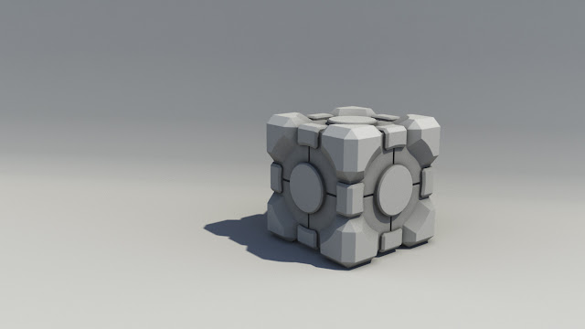
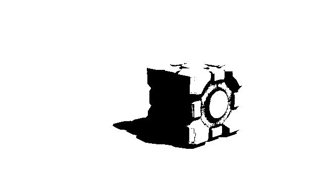
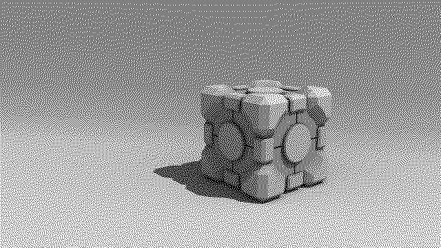
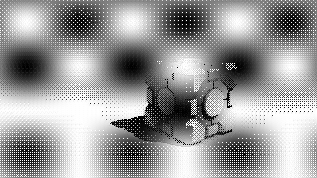

# Image Dithering

Image Dithering is a Python package that provides a simple implementation of four popular dithering algorithms, Threshold, Error diffusion (Floyd-Stienberg), Ordered and Pattern (Halftone) Dithering techniques. Dithering is a technique used in image processing to reduce the number of colors in an image while still maintaining the visual appearance of the original image. The code is written in Python and uses the NumPy and Pillow libraries.

## Installation

To install Image Dithering, simply clone this repository to your desktop. It's recommended to use PyCharm IDE.


## Usage

Here's an example of how to use Image Dithering to convert an image to a 2-bit color palette using the threshold algorithm. Where `input.jpg` is the provided image as an input, `output_threshold.jpg` is the name of the output image generated by the algorithm, and `128` is the threshold value:

```
threshold_dithering('input.jpg', 'output_threshold.jpg', 128)
```

## Contributing

I would love to have some contributions, So if you would like to contribute to Image Dithering, please follow these steps:

1. Fork the repository
2. Create a new branch
3. Make your changes and commit them
4. Push to the branch
5. Create a new pull request

## Examples

Here is an example of an image before and after dithering:
1. Original image:

  

2. Threshold algorithm image



3. Error Diffusion algorithm 



4. Ordered Dithering algorithm 



5. Pattern Dithering algorithm (with 4 shades of gray)


## License
This code is licensed under the MIT License. See the LICENSE file for details. 
